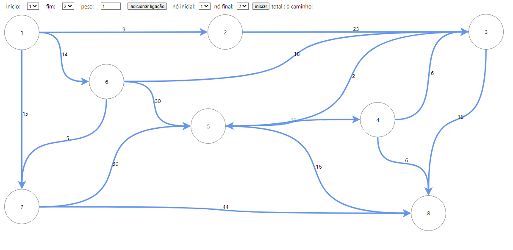
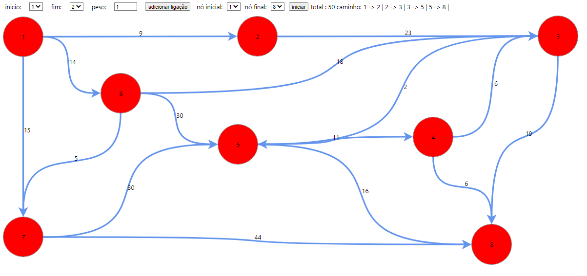

# Dijkstra

**Número da Lista**: 2<br>
**Conteúdo da Disciplina**: Grafos<br>

## Alunos
|Matrícula | Aluno |
| -- | -- |
| 16/0127891  |  João Vitor de Moura Rosa Silva |
| 16/0016169  |  Nícalo Ribeiro |

## Sobre 
O objetivo do projeto é demonstrar o algoritmo de Djiskra.

## Vídeo de Apresentação  
[Vídeo de apresentacao](grafos1-hotspot/Grafos1-Hotspot.mp4)  
Caso o link não funcione, o vídeo está dentro da pasta 'grafos1-hotspot' e tem o nome de 'Grafos1-Hotspot.mp4'

## Screenshots

App iniciado



Final




## Instalação 
**Linguagem**: Javascript<br>
**Framework**: ReactJs<br>
requisitos: npm ou yarn

## Uso 
```
npm install
```

```
npm start
```

## Outros 
O projeto inicia com alguns nós e arestas na tela, sendo possivel adicionar mais arestas, escolher os pontos de inicio e fim e arrastar os nós.


